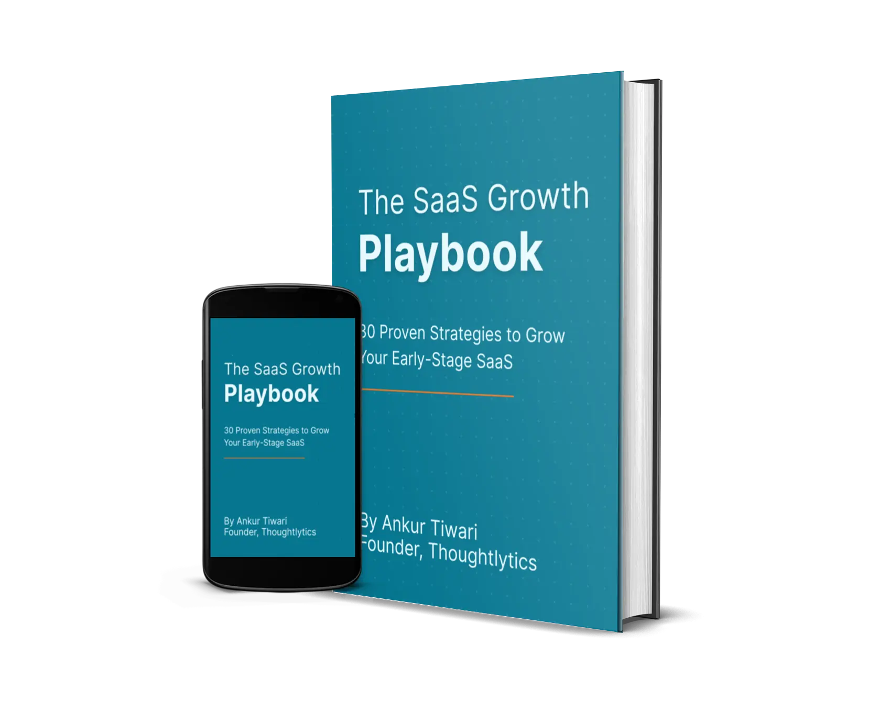

# SaaS Growth Playbook

This is the companion GitHub repository for the [**SaaS Growth Playbook**](https://www.thoughtlytics.com/saas-growth-playbook), a 200-page resource for early-stage SaaS founders.

It includes:
- Proven strategies for acquisition, activation, and retention
- Real-world frameworks, case studies, and growth experiments
- Downloadable templates for hands-on execution

👉 All templates are organized by growth stage below.

  

---

## 📂 Templates by Growth Stage

| Category       | Folder                                 |
|----------------|----------------------------------------|
| Strategy       | [/templates/strategy](templates/strategy)       |
| Acquisition    | [/templates/acquisition](templates/acquisition) |
| Activation     | [/templates/activation](templates/activation)   |
| Retention      | [/templates/retention](templates/retention)     |

---

## 🧠 Full Chapter List

### 📌 **Part 1: The Foundation (Strategy & Positioning)**
1. A Founder's Guide to Jobs-to-be-Done: The Secret to Sharp Positioning  
2. The LTV-Anchor: A Smarter Way to Price Your Annual SaaS Plan  
3. How to Handle Freemium Abuse & Low-Conversion Traffic (The Smart Way)  

### 🚀 **Part 2: The Acquisition Engine (Getting Your First Customers)**
4. The "Velvet Rope" Strategy: How to Get Your First 20 B2B SaaS Customers  
5. How to Get Your First 100 Users with a Community-First Funnel (A Reddit Case Study)  
6. The Competitor Magnet: How to Attract Your Competitors' Best Customers  
7. The Scrappy Founder's Guide to SaaS Keyword Research (When You Have Zero Authority)  
8. The SEO Parasite: How to Get Leads from Your Competitor's #1 Ranking Blog Posts  
9. The Inbound PR Playbook: How to Get Your SaaS Featured in the Media  
10. The "One Case Study" Playbook: How to Get Free Distribution from Major Newsletters  
11. The Collaborative Content Playbook: How to Leverage Experts for Quality and Reach  
12. The Pillar Content Playbook: How to Drive Growth with Just One Great Article  
13. How to Recruit Your First 10 High-Quality Affiliates (Email Templates Included)  
14. The Complete Blueprint for a High-Performing SaaS Affiliate Program  

### 🔁 **Part 3: The Activation & Conversion Machine (Turning Users into Fans)**
15. How to Find Your SaaS Activation Metric (The "Aha!" Moment that Drives Retention)  
16. The Personalized Onboarding Playbook: A 2-Part Guide to Activating More Users  
17. The Two Channels of a Great Onboarding Experience: In-App and Email  
18. The PQL Playbook: How to Find Sales-Ready Leads Hidden in Your Product Data  
19. The Leaky Bucket Playbook: 7 Ways to Fix Your Free-to-Paid Conversion Rate  
20. The Reverse Trial: A Powerful Model to Increase SaaS Conversions  
21. The Freemium Bridge: How to Design a Free Plan That Converts to Paid  
22. The "Try Before You Sign Up" Playbook: A Guide to Ungated Product Demos  
23. How to Understand Your Best Customers (Without Buying Expensive Data)  
24. Find the Leaks in Your Funnel: A Free SaaS Marketing Funnel Simulator (Template Included)  

### 💼 **Part 4: The Sales & Retention Loop (Closing Deals & Keeping Customers)**
25. The B2B SaaS Sales Deck Template That Closed $45k in 30 Days  
26. The Consultative Demo: A 5-Step Playbook for Demos That Close Deals  
27. How to Get Powerful Customer Testimonials (Even If You Have No Reviews)  
28. Your Help Docs Are a Marketing Channel (You're Just Not Using Them Right)  
29. The SaaS Growth Lab: How to De-Risk Your Strategy with Small Ad Experiments  
30. The Developer-Led Growth Playbook: How to Get Engineers to Recommend Your SaaS  

---

## 📘 Download the Full eBook

[👉 Get the full 200-page PDF](https://www.thoughtlytics.com/saas-growth-playbook)
